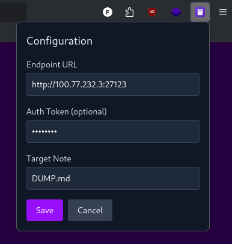
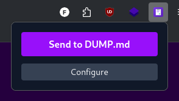

# Obsidian Web

A browser extension that allows you to quickly send the current webpage URL to your Obsidian notes.

## Who is this for?

This extension is designed for anyone who uses Obsidian and the [Obsidian Local REST API](https://github.com/coddingtonbear/obsidian-local-rest-api)plugin to manage their notes, and wants a simple way to save URLs from their browser directly into their Obsidian vault.

## Features

- **One-click URL sending**: Send the current webpage URL directly to your configured Obsidian note
- **Configurable endpoint**: Set your own Obsidian REST API endpoint
- **Flexible authentication**: Optional bearer token support for secured endpoints
- **Customizable target note**: Choose which note to send URLs to (defaults to `File.md`)
- **Cross-browser support**: Works on both Chrome and Firefox

## Installation

### Development

1. Clone this repository
2. Install dependencies: `npm install`
3. Build for your browser:
   - Chrome: `npm run build:chrome`
   - Firefox: `npm run build:firefox`
4. Load the extension in your browser:
   - **Chrome**: Open `chrome://extensions`, enable Developer mode, click "Load unpacked", select `dist_chrome` folder
   - **Firefox**: Open `about:debugging#/runtime/this-firefox`, click "Load temporary Add-on", select any file in `dist_firefox` folder

### Development Mode

For development with hot reload:

- Chrome: `npm run dev:chrome`
- Firefox: `npm run dev:firefox`

## Configuration

1. Click the extension icon in your browser toolbar
2. Click "Configure" to set up your Obsidian endpoint
3. Fill in the required fields:
   - **Endpoint URL**: Your Obsidian REST API endpoint (e.g., `http://localhost:27123`)
   - **Auth Token**: Bearer token for authentication (optional)
   - **Target Note**: The note file to send URLs to (e.g., `DUMP.md`)
4. Click "Save" to store your configuration

## Usage

1. Navigate to any webpage you want to save
2. Click the extension icon
3. Click "Send to [your configured note]"
4. The current webpage URL will be sent to your configured Obsidian note

## Requirements

- Obsidian with REST API plugin configured
- Modern browser (Chrome/Firefox) with extension support

## Permissions

The extension requires the following permissions:

- `activeTab`: To get the current webpage URL
- `storage`: To save your configuration settings
- `host_permissions`: To make requests to your configured Obsidian endpoint

## Technical Details

Built with:

- React 19
- TypeScript
- Tailwind CSS 4
- Vite
- webextension-polyfill for cross-browser compatibility

## License

MIT
